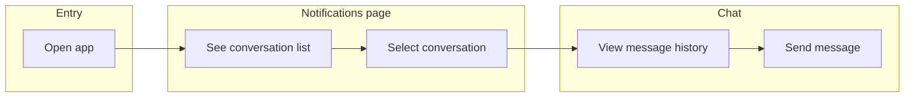

# Notifications + Chat — Context & Guidance

This document is the single source of truth for the notifications page and in-app chat feature. Use it to align scope, data model, and implementation order.

---

## 1. Purpose and scope

### Purpose

- **Notifications page**: Central place where users see conversation activity and open chats.
- **Chat**: Send and receive messages, see message history, and switch between conversations.
- **Goals**: Real conversations (not one-way alerts), full history within a conversation, and the ability to browse past conversations.

### In scope

- Notifications page as the entry point to conversations.
- In-app chat: send and receive messages in a chosen conversation.
- View previous messages in a conversation (message history).
- Browse and open past conversations (conversation list).

### Out of scope (for now)

- Push notifications to devices (mobile/browser push).
- Email digests or email-based replies.
- Other app pages or features unrelated to notifications/chat.
- Optional: call these out when you add new features so this doc stays focused.

---

## 2. Feature breakdown

### Notifications page

| Aspect | Description |
|--------|-------------|
| **Entry point** | List of notifications and/or conversation previews (e.g. last message, timestamp, unread state). |
| **Relation to chat** | Tapping/clicking a conversation opens the chat view for that conversation. |
| **Priority** | **Must-have**: list of conversations, open chat on select. **Nice-to-have**: unread badges, preview text, avatars. |

### Chat

| Aspect | Description |
|--------|-------------|
| **Core** | Send and receive messages in the selected conversation; messages appear in order (newest at bottom). |
| **Priority** | **Must-have**: send message, receive message, display messages in order. **Nice-to-have**: typing indicators, read receipts, delivery status. |

### Message history

| Aspect | Description |
|--------|-------------|
| **Behavior** | Within a conversation: load older messages (e.g. scroll to top or “Load more”); order = newest at bottom. |
| **Limits** | Define if needed (e.g. last 30 days, or “all history” with pagination). |
| **Priority** | **Must-have**: load and show older messages, correct order. **Nice-to-have**: infinite scroll vs explicit “Load more”. |

### Past conversations

| Aspect | Description |
|--------|-------------|
| **Placement** | List of conversations (sidebar on notifications page or separate screen). |
| **Sort** | By last activity (most recent first). |
| **Priority** | **Must-have**: list of conversations, sort by last activity, open any conversation. **Nice-to-have**: search/filter by name or content. |

---

## 3. User flows

### Flow A — Open chat and send a message

1. User opens the notifications page.
2. User sees the list of conversations.
3. User selects a conversation.
4. Chat view opens with message history (newest at bottom).
5. User types and sends a message.

### Flow B — React to a new message

1. A new message (or notification) arrives for the user.
2. It appears in the conversation list (e.g. updated preview, unread badge).
3. User opens the notifications page and selects that conversation.
4. Chat view opens; user sees the new message and can reply.

### Flow C — Browse past conversations and history

1. User opens the notifications page.
2. User scrolls or browses the conversation list (sorted by last activity).
3. User opens a past conversation.
4. User scrolls up (or uses “Load more”) to see older messages.

### Flow diagram (high level)

---

## 4. Data model (conceptual)

Stack-agnostic; implement with your chosen backend/DB.

### User

- Identifies who sends and receives messages.
- Fields (conceptual): unique id, display name, optional avatar/photo URL.
- Used for: message sender, conversation participants.

### Conversation

- Container for messages between one or more participants.
- **Recommendation**: Start with **1:1** conversations; add group chats later if needed.
- Fields (conceptual): unique id, participant ids, created/updated timestamps, optional title or “last message” summary for the list.

### Message

- A single chat message.
- Fields (conceptual): unique id, conversation id, sender id, body (text or rich content), timestamp, optional status (e.g. sent / delivered / read), optional reply/thread reference.

### Notification

- **Option A (simplest)**: Notifications are “the conversation list” — each row is a conversation with last message and timestamp; no separate notification entity.
- **Option B**: Separate notification entity (e.g. “new message in conversation X”) with a link to the conversation; supports future types (e.g. system announcements).
- **Recommendation**: Start with Option A; introduce Option B when you need multiple notification types or a distinct notification feed.

---

## 5. Technical considerations

### Realtime vs polling

- **Must-have**: Either **realtime** (WebSockets, SSE, or a provider like Pusher/Ably) or **short-interval polling** so new messages appear without a full refresh.
- **Recommendation**: Prefer realtime for a chat feel; use polling as a fallback or for MVP if simpler.

### Auth

- Only **participants** of a conversation can see that conversation and its messages.
- Decide early: logged-in users only, or anonymous/link-based access (e.g. magic link). Document the choice in “Open decisions” until fixed.

### Persistence

- Messages and conversation list must be stored durably (backend DB or BaaS such as Firebase/Supabase).
- Store at least: users, conversations, conversation participants, messages (with sender, timestamp, content). Optionally: read/delivery status, reply refs.

### Ordering and pagination

- **Conversation list**: Ordered by last activity (e.g. `last_message_at` or `updated_at`), newest first.
- **Messages in a conversation**: Ordered by timestamp, ascending (oldest first for “newest at bottom” display).
- **Pagination**: Use cursor- or offset-based “load more” for message history to avoid loading entire history at once.

---

## 6. Implementation guidance / phases

Use this order so each phase builds on the previous one.

| Phase | Scope | Outcome |
|-------|--------|--------|
| **Phase 1** | Notifications page shell + conversation list (static or from API). Tapping a conversation opens a chat view (mock messages OK). | User can open the page, see a list, and open a chat UI. |
| **Phase 2** | Send and receive messages in the chat view with real persistence; add realtime or polling so new messages appear. | Working send/receive and storage. |
| **Phase 3** | Message history: load older messages (scroll up / “Load more”), correct ordering, empty states, basic error handling. | Full history and robust UX. |
| **Phase 4** | Past-conversation browsing: sorting by last activity, optional search/filter, polish. | Complete notifications + chat experience. |

### Stack recommendations (optional)

- **Frontend**: Any SPA or full-stack framework (e.g. React, Next.js, Vue) with a clear place for a notifications route and a chat component.
- **Backend**: Your own API + DB, or a BaaS (e.g. Supabase, Firebase) for auth, conversations, and messages.
- **Realtime**: WebSockets (custom or Socket.io), SSE, or a managed service (Pusher, Ably) — choose one and document it in “Open decisions” when decided.

---

## 7. Open decisions / placeholders

Resolve these when making technical or product choices; update this section as decisions are made.

| Topic | Notes |
|-------|--------|
| **Tech stack** | Framework, backend, realtime layer, database. |
| **1:1 vs group** | Start with 1:1; document when/if group chats are in scope. |
| **Notification type** | Conversation list only (Option A) vs separate notification entities (Option B). |
| **Moderation / limits** | Message length limits, retention (e.g. 30 days), content moderation, reporting. |
| **Auth** | Logged-in only vs anonymous/link-based access. |

---

## File and updates

- **Location**: This file (`NOTIFICATIONS_CHAT_SPEC.md`) at repo root (or `docs/NOTIFICATIONS_CHAT.md` if you move it).
- **Updates**: When scope, flows, or technical choices change, update this doc so it remains the single source of truth for the notifications and chat feature.
